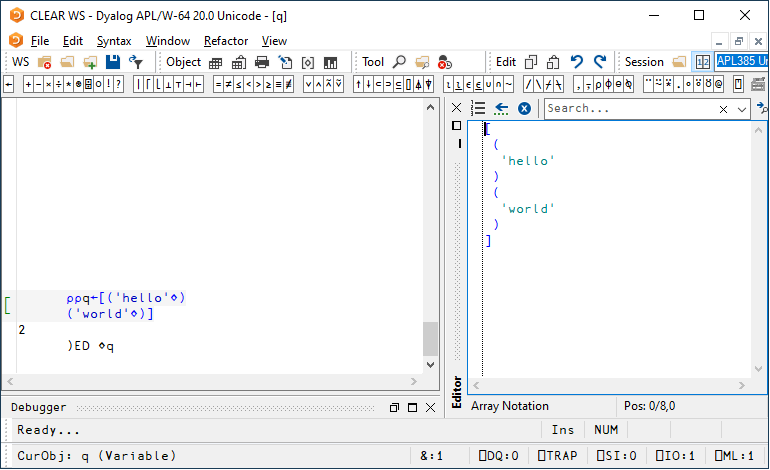

<h1 class="heading"><span class="name">Array Editor</span></h1>

The Array Editor[^1] allows you to edit arbitrary arrays using [array notation](FIXME).

Any of the following invokes it:

- Click the  icon in the Session toolbar when the mouse pointer is over the name of a suitable variable.
- Call the system command `)ED` and prefixing the variable name with a diamond; for example: `)ED ⋄q`
- Call the system function `⎕ED` with a left argument `'⋄'`; for example, `'⋄'⎕ED'q'`.

The Array Editor presents the array in array notation for you to edit. 



<!-- ## Documentation

Full documentation for the Array Editor, including a list of the keystrokes it uses, is available from the Help menu in the Array Editor's window.
 -->

## Apply code within the editor

You can prefix an array with a function.
The Array Editor will apply it when you fix the array.

For example, suppose the function `lower` maps upper-case characters to lower case.
In the Array Editor
```apl
lower[
 (
  'Hello'
 )
 (
  'World'
 )
]
```
fixes as
```
┌─────┐
│hello│
├─────┤
│world│
└─────┘
```


## Supported Arrays

The Array Editor supports arrays that consist solely of characters and/or numbers. It signals a NONCE ERROR if the array contains an object reference or a `⎕OR`.

## Notes

- The Array Editor is supplied only with Unicode Editions of Dyalog APL/W. 
- Namespaces are not supported.
- Internal representations returned by `⎕OR` are not supported.
<!-- - Negative numbers must be represented using high minus signs. For example, `¯3` not `-3`. -->

<!-- 
s### Implementation

The Array Editor is implemented by a DLL named `dlaedit.dll` (32-bit) or `dlaedit64.dll` (64-bit).

The DLL exports two functions:  `DyalogEditArray` and `DyalogEditArrayTitle`. The latter is used when you click  the  icon in the Session toolbar (via the APL function `⎕SE.NumEd.numed`)  and by the user command `]array.edit`

### Calling the Array Editor Directly

If you wish to use the Array Editor directly, you may do so as follows using `⎕NA`[^2].

For both `DyalogEditArray` and `DyalogEditArrayTitle` the first argument is the array to be edited, while the second argument is a place holder and should always be 0

For `DyalogEditArrayTitle` the 3rd argument is a character vector whose contents are displayed in the caption of the array editor window.

The result is the newly altered array.

<h3 class="example">Examples</h3>
```apl
⎕NA'dlaedit.dll|DyalogEditArray <pp >pp'              ⍝ 32-bit
⎕NA'dlaedit.dll|DyalogEditArrayTitle <pp >pp <0C2[]'  ⍝ 32-bit
			
⎕NA'dlaedit64.dll|DyalogEditArray <pp >pp'            ⍝ 64-bit
⎕NA'dlaedit64.dll|DyalogEditArrayTitle <pp >pp <0C2[]'⍝ 64-bit
			
New←DyalogEditArray Old 0
New←DyalogEditArrayTitle Old 0 Name
```
 -->

[^1]: The Array Editor replaces an earlier tool written by David Liebtag.
